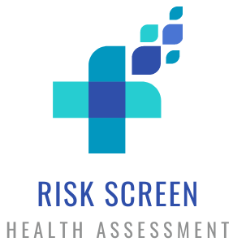
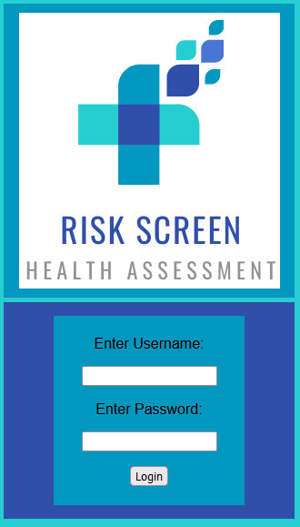
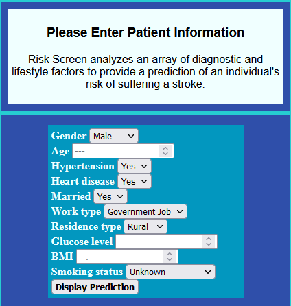
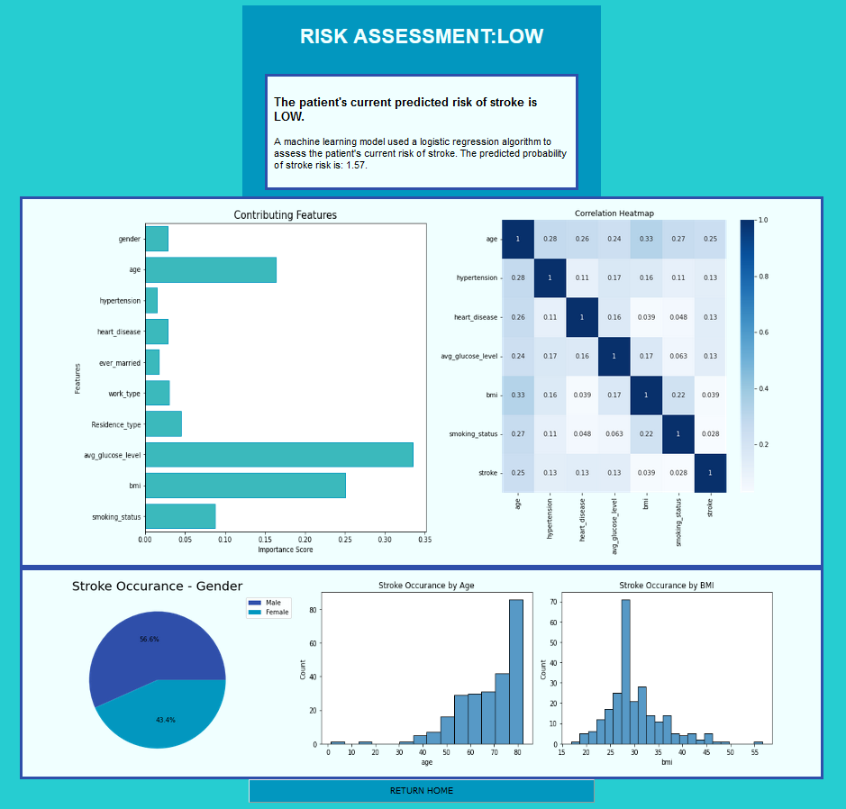

#  ***RISK SCREEN*** - STROKE RISK PREDICTOR 

## :clipboard: OVERVIEW
As I approached the end of my academic study in computer science, I elected to develop a Flask application that leverages machine learning to predict stroke risk. This project was the culmination of everything that I had learned in the build up to completing my bachelors degree in computer science and integrates several sub-domains of study ranging from artificial intelligence and machine learning to software engineering and design.

## :bar_chart: APPLICATION PURPOSE
This simple Flask application was created as a prototype to help healthcare providers quickly assess a patient's stroke risk. A publicly available healthcare data set on the incidence of stroke was used to train a machine learning model and uses patient information that is typically collected during check-in / registration to be used as inputs to evaluate stroke risk.

The dataset was carefully cleaned to ensure no outliers / abnormalities could influence the prediction. In its initial form, it used a decision tree classifier but I decided to update it using logistic regression algorithm instead as it tended to performed better. 

## :computer: TECHNOLOGIES
* Python
* Jupyter Notebook
* Numpy
* Pandas
* Matplotlib
* Seaborn
* PyCharm (Professional 2021.2)
* Flask
* Heroku

## :page_with_curl: SCOPE OF FUNCTIONALITIES
* ### Allows only authorized users to log-in to the application:

* ### Allows patient information to be entered to gain a stroke risk prediction:

* ### Returns patient's stroke risk prediction as well as contributing features to risk & other health related data:

## :bulb: LESSONS LEARNED
I gained a great deal of exposure to AI, machine learning, and data science in the process of working on this project and found myself in awe of the depth & bredth of the field. I had a shift in perspective when it came to how technology can impact humanity as a whole. Its easy to visualize software that simplifies our lives by managing the tangible things, like keeping track of inventory. But this project highlighted the ways in which we can use technology to enhance the quality of our lives, discover new information from our own data, and influence the decisions we make.

I initially deployed the application using Heroku but pulled it down in October 2021 until I have an opportunity to polish its funtionality.
